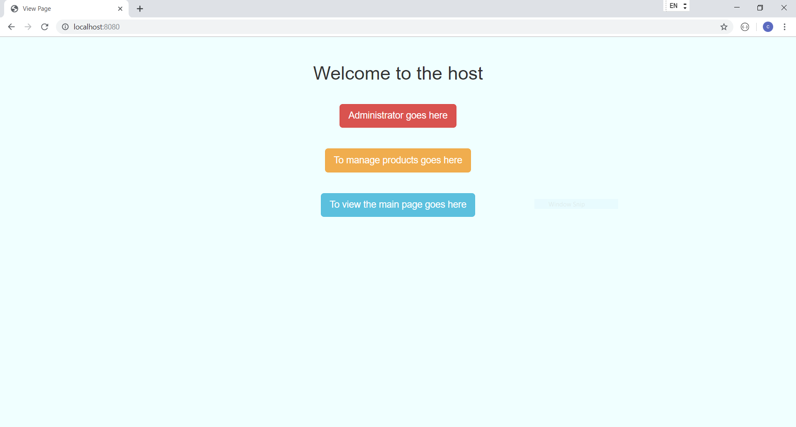
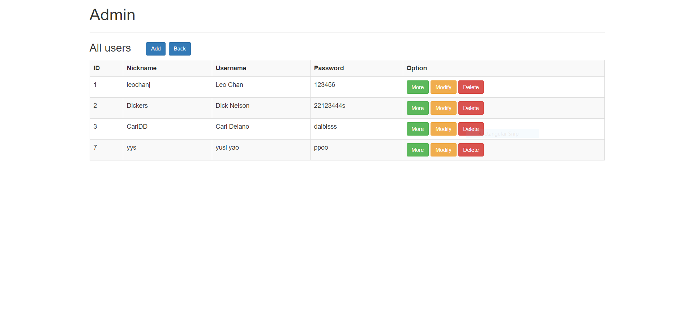
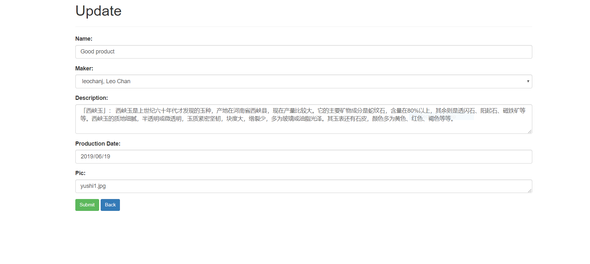
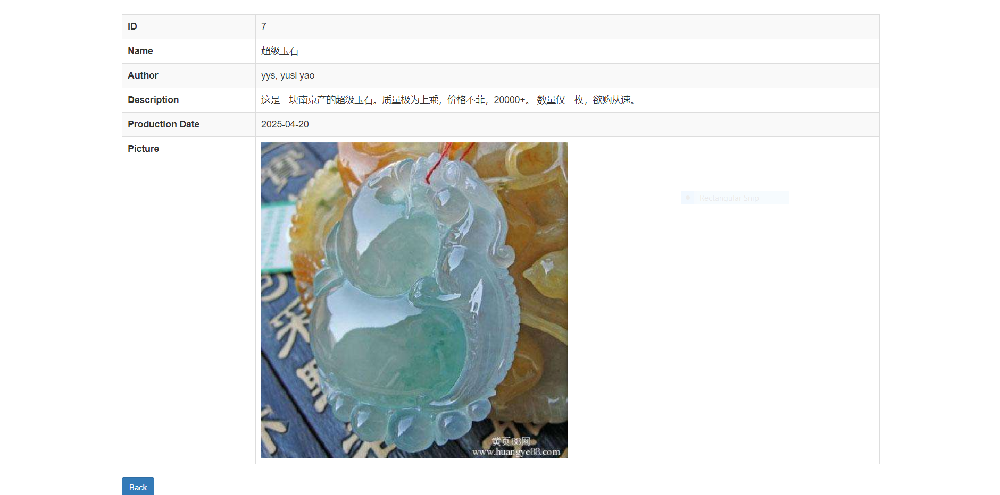

# TYTManagement
This is a demo of the product/user management system created for the jade enterprise TYT Entertainment. 

## Getting started
This web management system is build with springmvc & hibernate & maven.

### Pre-requieites
To run this demo, you need a tomcat server and a mysql / oracle server.    For developers, you need maven support for this app.

### How to use
Download the files and load them into your IDE. Then edit the datebase connection configurations in src/main/java/META-INF/persistence.xml.  
To make any changes to the actual application, please edit files in src/main/webapp.

### Repositories
  webapp/res: static css, pngs and javascript files
  WEB-INF/pages/* : web pages
  WEB-INF/mvc-dispatcher-servlet.xml: configuration file for the servlet
  WEB-INF/web.xml: basic configurations
  WEB-INF/index.jsp: starting page
 
 
### Pages

## Built with
  Maven - Dependency Management
  SpringMVC - Main app frame
  Hibernate - Data persistence tool

## Authors
Leo Chan - Student at UNC-Chapel Hill, USA

## Disclaimer
This project is for demonstrative purpose only. Any replication of it should be restricted to non-commercial uses only.   
All files, images, style sheets are created either by the authors or from free / opensourced materials on the internet.   

## Acknowledgement
This project is only a demo. TYT Entertainment is the company who owns the full version of this application.   To view the full version, please contact TYT Entertainment.

